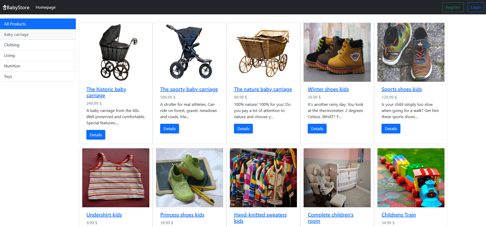
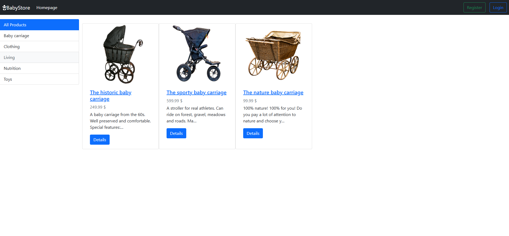
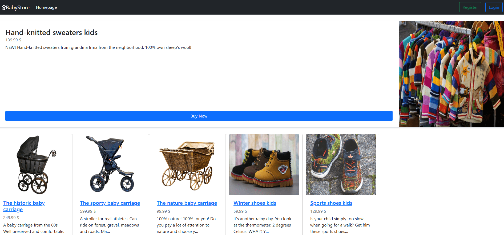
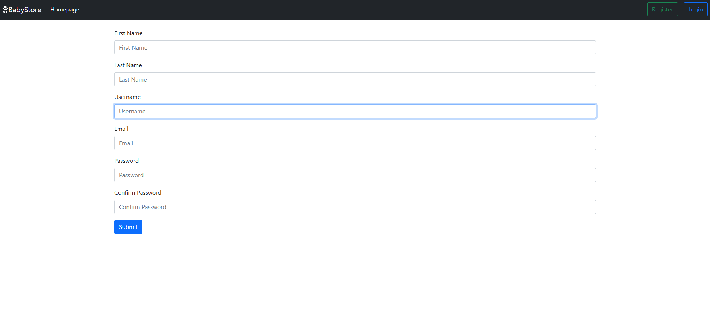
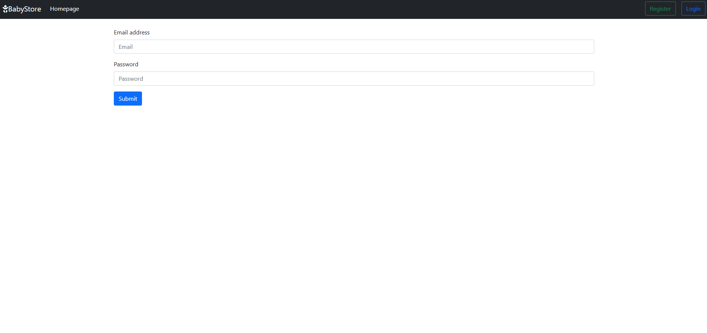

import GithubLinkAdmonition from '@site/src/components/GithubLinkAdmonition';

<GithubLinkAdmonition link="https://github.com/PascalNehlsen/baby-tools-shop" text="Github Repository" type="info">
**Reach me out via** [LinkedIn](https://www.linkedin.com/in/pascal-nehlsen)**,** [Portfolio Contact Form](https://pascal-nehlsen.de/#contact) **or** [mail@pascal-nehlsen.de](mailto:mail@pascal-nehlsen.de)
</GithubLinkAdmonition>

# Baby Tools Shop

In this blog post, we’ll explore the setup and deployment of the `Baby Tools Shop`, a `Django-based` e-commerce application for managing and purchasing baby tools. This project is containerized using Docker and can be deployed to a virtual machine (VM) with ease. We'll cover how to set up the environment, configure the app, and run it in `Docker`.

## Quickstart (README)

### Prerequisites

- Python 3.9 and Django 4.0.2
- A virtual environment for Python (venv)
- Docker installed on the target machine

1. Setting Up the Python Environment

To get started with the **Baby Tools Shop**, first, create a virtual environment for Python:

```bash
python -m venv your_environment_name
```

- Activate the virtual environment:

  ```bash
  your_environment_name\Scripts\activate  # On Windows
  source your_environment_name/bin/activate  # On Linux/Mac
  ```

- Navigate to the project directory:

  ```
  cd babyshop_app
  ```

- Install Django 4.0.2

  ```
  python -m pip install Django==4.0.2
  ```

2. Install Dependencies

Move to the project root and create a `requirements.txt` file to list all dependencies:

```
cd ..
nano requirements.txt
```

- Add the following to `requirements.txt`:

```
Django==4.0.2
pillow==10.4.0
```

3. Apply Migrations

Run Django's migration commands to set up the database:

```
python manage.py makemigrations
python manage.py migrate
```

4. Create a Superuser

Create a superuser for Django’s admin panel:

```
 python manage.py createsuperuser
```

You will be prompted to enter a username, email, and password. Ensure you use a `DJANGO_SUPERUSER_USERNAME`, `DJANGO_SUPERUSER_EMAIL`, and a `DJANGO_SUPERUSER_PASSWORD` for this.

5. Run the Development Server

Run the Django development server:

```
 python manage.py runserver
```

- You can access the admin panel at `http://<your_ip>:8000/admin`

Log in with your superuser credentials and start creating products!

## Configuration

1. Modify ALLOWED_HOSTS for Production

To deploy the Baby Tools Shop in a production environment, you need to modify the `ALLOWED_HOSTS` setting in `settings.py` to include your server’s IP address or domain name:

    ```
    ALLOWED_HOSTS = ['your_domain_or_ip']
    ```

This ensures your Django app only accepts requests from trusted domains, protecting it against HTTP Host header attacks.

## Deploying with Docker

1. Create a Dockerfile

In the project directory, create a Dockerfile to containerize the Django app:

    ```
    # Use an official Python image as the base
    FROM python:3.9-slim

    # Set the working directory inside the container

    WORKDIR /app

    # Copy only the requirements file and install dependencies

    COPY requirements.txt ${WORKDIR}
    RUN python -m pip install --no-cache-dir -r requirements.txt

    # Copy the code into the working direction

    COPY . ${WORKDIR}

    # Change to the app directory and run database migrations

    WORKDIR /app/babyshop_app
    RUN python manage.py makemigrations && python manage.py migrate

    EXPOSE 8025

    # This is the command that will be executed on container launch

    ENTRYPOINT ["sh", "-c", "python manage.py runserver 0.0.0.0:8025"]
    ```

2. Build the Docker Image

Copy the project folder to your virtual machine and build the Docker image:

    ```
    docker build -t app_name .
    ```

This command creates a Docker image from your Dockerfile, tagged as app_name, ready for deployment.

3. Create Docker Volumes

To persist data across container restarts, create Docker volumes:

    ```
    docker volume create babyshop_db
    docker volume create babyshop_media
    docker volume create babyshop_static
    ```

    - babyshop_db: Volume for storing database data.
    - babyshop_media: Volume for storing user-uploaded media files.
    - babyshop_static: Volume for storing static files like CSS and JS.

4. Run the Docker Container

Run the Docker container using the image you built:

    ```
    docker run -d --name app_name_container \
      -p 8025:8025 \
      -v babyshop_db:/app/babyshop_app/db \
      -v babyshop_media:/app/babyshop_app/media \
      -v babyshop_static:/app/babyshop_app/static \
      --restart on-failure \
      app_name
    ```

This command does the following:

- Runs the container in detached mode (`-d`).
- Maps port `8025` on the host to port `8025` in the container, making the app accessible via `http://<vm_ip>:8025/`.
- Mounts volumes to ensure data persistence.
- Automatically restarts the container if it fails.

  - Restart policy (--restart on-failure): Automatically restarts the container if it fails, but not if stopped manually.

  - You can access your app at `http://<vm_ip>:8025/`

5. Access the Admin Panel

To create a superuser inside the running container, first list active containers:

    ```
    docker ps
    ```

Then, access the container's terminal:

    ```
    docker exec -it <container_name_or_id> /bin/bash
    ```

Create the superuser:

    ```
    python manage.py createsuperuser
    ```

Once done, exit the container shell:

    ```
    exit
    ```

Now, you can log into the admin panel at:
`http://<vm_ip>:8025/admin`

## Hints and Tips

1. **Settings & Configuration**:
   All relevant settings for the Django project can be found in babyshop_app/babyshop/settings.py. This includes settings for the database, static files, and security configurations.

2. **Routing Information**:
   You can check the routing details by reviewing the urls.py files located in babyshop_app and its subdirectories. These files define the available routes for users to navigate through the application.

# Detailed Explanation (Writeup)

1. Why Use Docker for Deployment?
   Docker simplifies the process of packaging and deploying applications by providing a consistent environment. By using Docker, you eliminate discrepancies between development and production environments, making the deployment process smooth and reliable. The use of Docker volumes ensures data persistence even if containers are stopped or recreated, which is crucial for production environments.

2. Configuring ALLOWED_HOSTS
   Django’s `ALLOWED_HOSTS` setting ensures that only requests from specific IPs or domains are accepted, preventing potential security risks like HTTP Host header attacks. For production, it’s essential to replace `localhost` with your actual domain or IP address to allow external access.

3. Docker Volumes for Data Persistence
   When using Docker, containers are often stateless, meaning data stored inside them could be lost when the container is removed. By using Docker volumes for critical components like the database and media files, you ensure that important data is stored safely, even if the container is destroyed or restarted.

## Screenshots

##### Home Page with login



##### Home Page with filter



##### Product Detail Page



##### Register Page



##### Login Page



## Conclusion

The Baby Tools Shop project showcases how to create and deploy a Django e-commerce application using Docker. By containerizing the app, you ensure a smooth and consistent deployment process. Docker volumes help persist data, while Docker’s flexibility allows for easy scaling and management in a production environment.

If you need further assistance, feel free to reach out!
