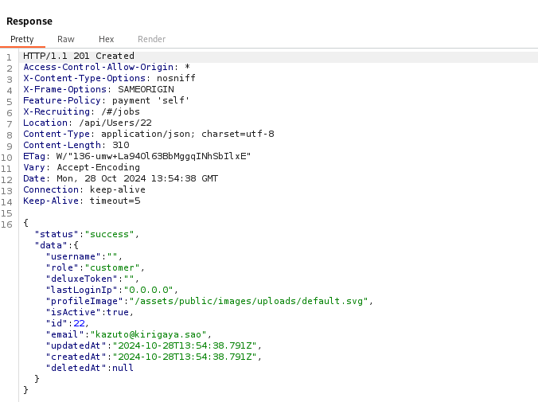
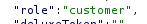
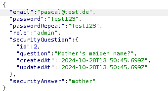
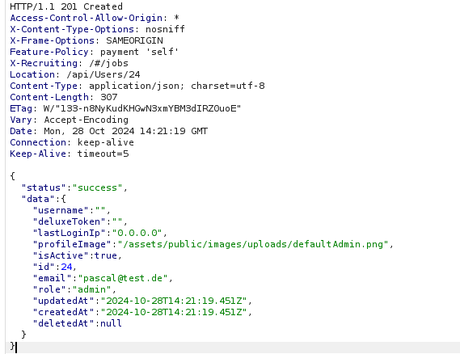
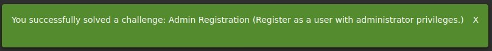

import GithubLinkAdmonition from '@site/src/components/GithubLinkAdmonition';

<GithubLinkAdmonition link="https://github.com/PascalNehlsen/juice-shop-challenges/blob/main/challenges/admin-registration.md" text="Github Repository" type="info">
**Reach me out via** [LinkedIn](https://www.linkedin.com/in/pascal-nehlsen)**,** [Portfolio Contact Form](https://pascal-nehlsen.de/#contact) **or** [mail@pascal-nehlsen.de](mailto:mail@pascal-nehlsen.de)
</GithubLinkAdmonition>
# Admin Registration Challenge Report

:::danger[Only for Testing Purposes]
This tool is intended for educational and authorized penetration testing purposes only. Unauthorized use of this tool against systems that you do not have explicit permission to test is illegal and unethical.
:::

**Project**: OWASP Juice Shop - Admin Registration Challenge (Improper Input Validation) <br/ >
**Tools**: Kali Linux with Burp Suite <br/ >
**Author**: Pascal Nehlsen <br/ >
**Portfolio**: [https://www.pascal-nehlsen.de/](https://www.pascal-nehlsen.de/) <br/ >
**GitHub Link**: [https://github.com/PascalNehlsen/juice-shop-challenges/blob/main/challenges/admin-registration.md](https://github.com/PascalNehlsen/juice-shop-challenges/blob/main/challenges/admin-registration.md)

## Table of Contents

1. [Introduction](#Introduction)
2. [Objective](#Objective)
3. [Approach](#Approach)
   - [Step 1: Information Gathering](#step-1-information-gathering)
   - [Step 2: Modifying the Registration Request](#step-2-modifying-the-registration-request)
4. [Conclusion](#Conclusion)

### Introduction

The OWASP Juice Shop is a deliberately vulnerable web application designed to demonstrate various security vulnerabilities. This report outlines the steps I followed to complete the Admin Registration Challenge.

### Objective

The Admin Registration Challenge involves registering a user as an administrator. Under normal conditions, a user cannot obtain admin rights through the standard registration process. The objective here was to manipulate the registration mechanism or exploit a vulnerability to register as an administrator.

### Approach

#### Step 1: Information Gathering

To understand what data is sent to the server during the registration process, I used Burp Suite's proxy tool to intercept the HTTP requests with "Intercept is on." By examining the captured requests, I found the endpoint `/api/Users/`, where registration information is sent and stored in the server response. Send this request to the Repeater in Burp Suite to see the Response of this `POST` Request.

Within the JSON response, I noticed the key `"role"` with the value `"customer"`, indicating the default user role.

#### Step 2: Modifying the Registration Request

I sent this `POST` request to Burp Suite's Repeater tool, which allowed me to modify and resend the request. I added the `"role"` key with the value `"admin"` to the request to attempt an admin registration.

Upon sending this request, I received an HTTP status code `201` and a success message, confirming that a user was successfully registered as an admin.

### Conclusion

This test successfully completed the Admin Registration Challenge by modifying the `POST` request to include the `"role": "admin"` parameter, allowing a standard user to be registered with administrator privileges.

