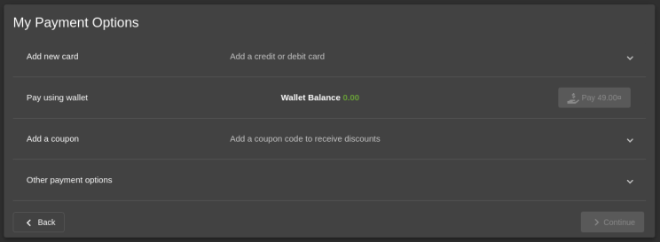
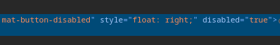
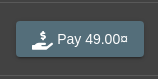
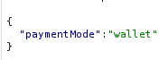
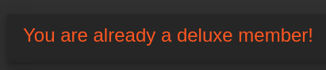
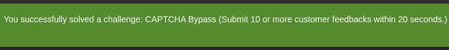

# Deluxe Fraud Challenge Report

:::danger[Only for Testing Purposes]
This tool is intended for educational and authorized penetration testing purposes only. Unauthorized use of this tool against systems that you do not have explicit permission to test is illegal and unethical.
:::

**Project**: OWASP Juice Shop - Deluxe Fraud Challenge (Improper Input Validation) <br/ >
**Tools**: Kali Linux with Burp Suite, Firefox Developer Tools <br/ >
**Author**: Pascal Nehlsen <br/ >
**Portfolio**: [https://www.pascal-nehlsen.de/](https://www.pascal-nehlsen.de/) <br/ >
**GitHub Link**: [https://github.com/PascalNehlsen/juice-shop-challenges/blob/main/challenges/deluxe-fraud.md](https://github.com/PascalNehlsen/juice-shop-challenges/blob/main/challenges/deluxe-fraud.md)

## Table of Contents

1. [Introduction](#Introduction)
2. [Objective](#Objective)
3. [Approach](#Approach)
   - [Step 1: Information Gathering](#step-1-information-gathering)
   - [Step 2: Manipulating the Purchase Request](#step-2-manipulating-the-purchase-request)
4. [Conclusion](#Conclusion)

### Introduction

The OWASP Juice Shop is a deliberately vulnerable web application designed to demonstrate security vulnerabilities. This report details the steps I took to complete the Deluxe Fraud Challenge.

### Objective

The objective of the Deluxe Fraud Challenge is to find a way for the user to obtain the "Deluxe Membership" of the OWASP Juice Shop for free or to fraudulently bypass payment processes. This simulates real-world attacks where attackers attempt to manipulate payments or enforce discounts to acquire products without proper payment.

### Approach

#### Step 1: Information Gathering

First, I navigated to the section where users can purchase the Deluxe Membership.

Upon clicking "Become a Member," I noticed that the membership costs $49.00, while our wallet balance showed $0.00. The purchase button was also disabled.

To investigate how the button was disabled, I checked the Firefox Developer Tools.

In the HTML, I found the attributes `mat-button-disabled` and `disabled='true'`. By removing these attributes through the console, I was able to activate the button.

#### Step 2: Manipulating the Purchase Request

However, clicking the button did not trigger any action. Therefore, I intercepted the request sent when clicking the button using Burp Suite. The intercepted request was a `POST` request containing a JSON object.

The `paymentMode` indicated that we wanted to pay using our wallet, but since we had no balance, I modified the `paymentMode` to an empty string. After clicking "Forward," I received a success message indicating that we were now a Deluxe Member. This was also verifiable on the website.

### Conclusion

This challenge was successfully completed by modifying the `POST` request, allowing me to obtain a Deluxe Membership without proper payment.

