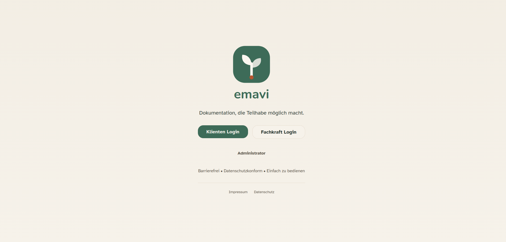
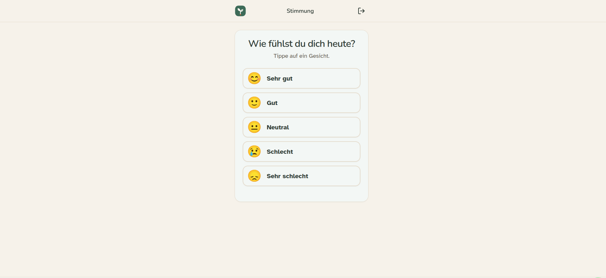
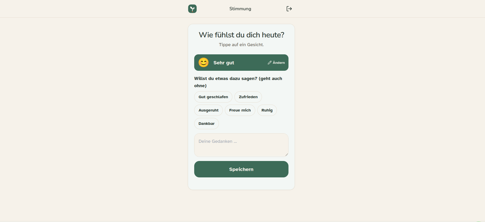
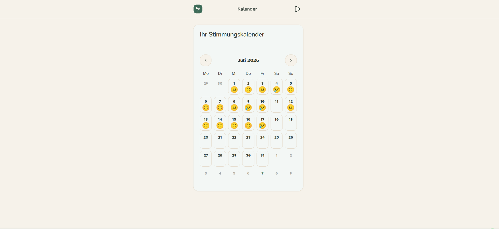
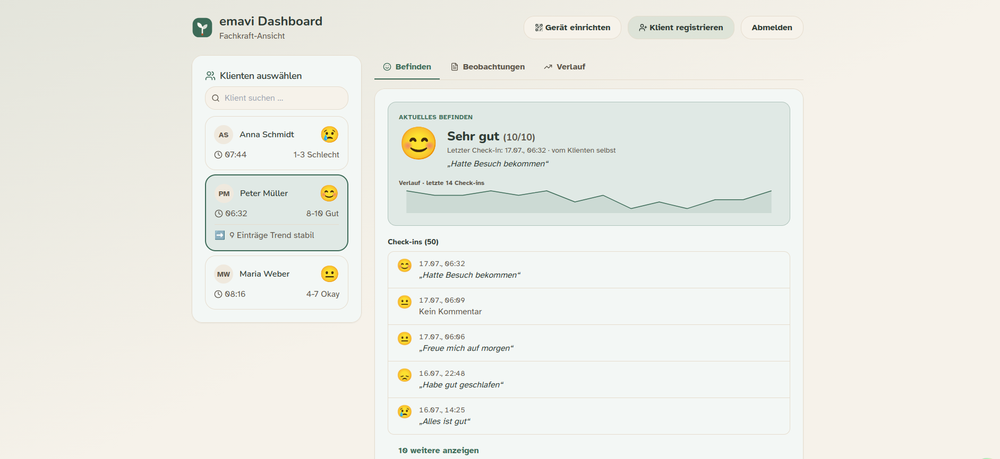
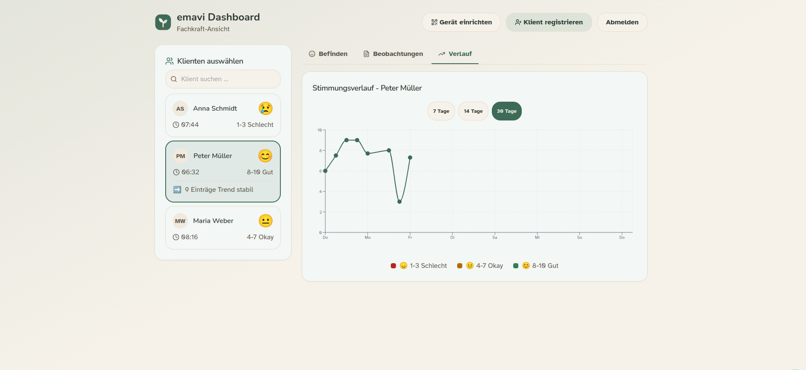

# Emavi

Ausgeliefert als **HepaAssist**, läuft heute als **Emavi**. Dieser Aufschrieb
behält den alten Namen dort, wo er Entscheidungen beschreibt, die unter ihm
getroffen wurden.

:::info[Live · Login erforderlich]
[emavi.de](https://emavi.de). Das Produkt liegt hinter einer Anmeldung, der Link
landet also auf einer Login-Seite. Architektur und Entscheidungen stehen unten.
:::

## Überblick

**Emavi** ist eine Multi-Tenant-Anwendung für Einrichtungen im Gesundheitswesen, die digitale Bewohnerdokumentation und Pflegeorganisation unterstützt. Das Projekt zeigt moderne DevSecOps-Praxis und Full-Stack-Entwicklung mit Schwerpunkt auf Sicherheit, Skalierbarkeit und Bedienbarkeit.

---

## Die zwei Oberflächen

Das Produkt hat eine harte Randbedingung, die alles andere geprägt hat: dieselben
Daten werden von Bewohnerinnen und Bewohnern eingegeben und von Pflegekräften
gelesen, und diese zwei Gruppen haben in Sachen Bedienbarkeit fast nichts
gemeinsam. Deshalb gibt es zwei Oberflächen und nicht eine mit Rollenumschalter.

### Bewohnersicht

Eine Entscheidung pro Bildschirm, große Ziele, keine Verschachtelung. Ein
Check-in sind drei Antippen und kann nach dem ersten fertig sein: der
Kommentarschritt ist ausdrücklich optional, denn ein Pflichtfeld ist ein Grund,
etwas nicht mehr zu benutzen.









Der Kalender ist absichtlich auch für die Bewohnenden da und nicht nur für das
Personal. Dokumentation, die nur nach oben fließt, ist Überwachung; der Sinn des
Produkts ist, dass die dokumentierte Person ihre eigene Aufzeichnung sehen kann.

### Personalsicht

Dieselben Daten, umgekehrte Prioritäten: Dichte, Vergleich und Verlauf über eine
Gruppe.





Die Screenshots nutzen eingespielte Demodaten. In diesem Aufschrieb erscheinen
keine echten Bewohnerdaten.

---

## Architektur und Technologie

### Backend
- **Framework**: FastAPI (Python), asynchron und performant
- **Datenbank**: PostgreSQL mit SQLAlchemy-ORM
- **Authentifizierung**: Multi-Tenant-Authentifizierung über JWT
- **API-Entwurf**: REST-API mit OpenAPI/Swagger-Dokumentation
- **Migrationen**: Alembic für die Schemaversionierung

### Frontend
- **Framework**: Next.js 14 (React) mit TypeScript
- **Styling**: Tailwind CSS für modernes, responsives Design
- **PWA**: Progressive Web App mit Offline-Unterstützung
- **UI-Komponenten**: eigene Komponentenbibliothek mit shadcn/ui
- **State**: React Context API für Tenant-Isolation

### DevOps und Infrastruktur
- **Containerisierung**: Docker und Docker Compose
- **Reverse Proxy**: nginx für Lastverteilung und SSL-Terminierung
- **Multi-Tenant-Architektur**: vollständige Datentrennung pro Tenant
- **Umgebungen**: getrennte Entwicklungs- und Produktionsumgebung

---

## Security zuerst (DevSecOps)

### Authentifizierung und Autorisierung
```python
# Multi-tenant JWT-based authentication
- Role-based access control (Admin, Staff, Resident)
- Tenant isolation at database level
- Secure password hashing with bcrypt
- Token-based session management
```

### API-Sicherheit
- **Eingabevalidierung**: Pydantic-Modelle für Requests und Responses
- **CORS**: strikte Cross-Origin-Regeln
- **Schutz vor SQL-Injection**: Queries über das ORM
- **Rate Limiting**: Schutz gegen Brute-Force

### Datensicherheit
- **Verschlüsselung**: sensible Daten verschlüsselt im Transport und im Ruhezustand
- **DSGVO**: datenschutzkonforme Umsetzung
- **Audit-Logging**: nachvollziehbare Änderungshistorie
- **Tenant-Isolation**: strikte Datentrennung zwischen Tenants

---

## DevOps-Praxis

### Container-Strategie und Multi-Service-Aufbau

#### Orchestrierung per Docker Compose
Die Anwendung nutzt ein Setup aus mehreren Containern mit Abhängigkeiten und Health Checks:

```yaml
services:
  db:
    image: postgres:18-alpine
    healthcheck:
      test: ["CMD-SHELL", "pg_isready -U ${POSTGRES_USER}"]
      interval: 10s
      timeout: 5s
      retries: 5
    volumes:
      - postgres_data:/var/lib/postgresql/data
    networks:
      - hepaassist-network

  backend:
    image: ghcr.io/pascalnehlsen/hepa-assist-backend:latest
    depends_on:
      db:
        condition: service_healthy
    ports:
      - "8001:8001"
    env_file:
      - .env

  frontend:
    image: ghcr.io/pascalnehlsen/hepa-assist-frontend:latest
    depends_on:
      - backend
    ports:
      - "3001:3001"

  pgadmin:
    image: dpage/pgadmin4:9.10.0
    depends_on:
      - db
    ports:
      - "5050:80"
```

#### Merkmale der Container-Architektur
- **Service-Abhängigkeiten**: gesteuerte Startreihenfolge über Health-Check-Bedingungen
- **Persistente Volumes**: Datenerhalt für PostgreSQL und PgAdmin
- **Netzwerkisolation**: eigenes Bridge-Netzwerk für die Kommunikation der Dienste
- **Restart-Policies**: `unless-stopped` für automatische Erholung
- **Port-Mapping**: konfliktfreie Ports für die lokale Entwicklung
- **Alpine-Images**: minimale Base-Images für kleinere Angriffsfläche

### CI/CD mit GitHub Actions

#### Automatisierter Deployment-Workflow
Vollautomatische Auslieferung vom Push bis in die Produktion:

```yaml
name: Deploy HepaAssist to VM

on:
  push:
    branches: [main]
  workflow_dispatch:

jobs:
  deploy:
    runs-on: ubuntu-latest
    steps:
      - Checkout repository
      - Set up Docker Buildx
      - Login to GitHub Container Registry
      - Build and push backend image
      - Build and push frontend image
      - Deploy via SSH to production VM
```

#### Was die Pipeline kann

**1. Anbindung an die Container-Registry**
```yaml
# GitHub Container Registry (GHCR)
Registry: ghcr.io
Image Naming: pascalnehlsen/hepa-assist-{backend|frontend}
Tags: latest, branch-name, commit-sha
```

**2. Multi-Stage-Builds**
- Docker BuildKit für besseres Caching aktiviert
- Layer-Caching über den GitHub-Actions-Cache
- getrennte Build-Kontexte für Backend und Frontend
- kürzere Build-Zeiten über `cache-from` und `cache-to`

**3. Umgang mit Secrets**
```bash
# Environment variables injected from GitHub Secrets
- DATABASE_URL
- JWT_SECRET_KEY
- OPENAI_API_KEY
- SSH_PRIVATE_KEY for deployment
- Registry credentials (GHCR_PAT)
```

**4. Automatisierte Deployment-Schritte**
- Images mit Commit-SHA-Tags bauen
- in die Container-Registry pushen
- Konfigurationsdateien per SCP auf den Produktionsserver
- per SSH auf die VM und die Deployment-Befehle ausführen
- aktuelle Images ziehen
- Rolling Update ohne Ausfallzeit
- unbenutzte Images aufräumen

**5. Sicherheit beim Ausrollen**
- Authentifizierung über SSH-Key
- verschlüsselte Secrets in GitHub Actions
- keine festgeschriebenen Credentials im Repository
- Umgebungsvariablen sicher eingespeist

### Infrastructure as Code

#### Produktions-Deployment
```bash
# Automated deployment via SSH
cd /opt/hepaassist
docker compose pull
docker compose up -d --remove-orphans
docker image prune -f
```

#### Konfiguration der Umgebungen
- **Entwicklung**: lokales Docker Compose mit Hot Reload
- **Produktion**: Deployment auf einer VM mit Caddy als Reverse Proxy
- **Secrets**: `.env`-Dateien je Umgebung
- **SSL/TLS**: automatische Zertifikatsverwaltung

### Was die Container konkret bringen

**Entwicklung**
- gleiche Umgebungen für alle im Team
- Setup mit einem Befehl: `docker-compose up`
- isolierte Abhängigkeiten
- Hot Reload für schnelle Iteration

**Verlässlichkeit in Produktion**
- unveränderliche Deployments
- einfaches Zurückrollen auf frühere Versionen
- Health Checks für automatische Erholung
- Deployments ohne Ausfallzeit

**Skalierbarkeit**
- bereit für horizontales Skalieren
- Vorbereitung für Lastverteilung
- Connection Pooling zur Datenbank
- tauglich für ein Service Mesh

### Logging und Monitoring
```python
# Structured logging for production readiness
- Application logs in /backend/logs
- Docker container logs via docker logs
- Centralized logging preparation
- Error tracking and debugging
- Performance monitoring prepared
```

---

## Highlights aus der Full-Stack-Entwicklung

### Backend

#### 1. Multi-Tenant-Architektur
```python
# Tenant-isolated database access
class TenantMixin:
    tenant_id = Column(Integer, ForeignKey('tenant.id'))
    # Automatic tenant filtering in all queries
```

#### 2. REST-Endpunkte
- `/api/v1/auth` - Authentifizierung und Sitzungsverwaltung
- `/api/v1/admin` - administrative Funktionen
- `/api/v1/dashboard` - Bewohner-Dashboards
- `/api/v1/observations` - Pflegedokumentation
- `/api/v1/mood` - Stimmungserfassung
- `/api/v1/export` - PDF-Export

#### 3. Datenmodelle
```
Models:
  - User (Multi-role support)
  - Tenant (Tenant management)
  - Observation (Care documentation)
  - Mood (Mood tracking)
  - ObservationBlockTemplate (Configurable templates)
```

### Frontend

#### 1. Progressive Web App (PWA)
```javascript
// Offline-capable application with service worker
- Native app experience on mobile devices
- Push notifications
- Installable on iOS, Android, Windows
```

#### 2. Für mehrere Gerätetypen
```
Optimized for:
  - Smartphones (care staff on the go)
  - Tablets (resident interaction)
  - Desktop (administration)
```

#### 3. Oberflächen
- **Admin-Dashboard**: Verwaltung von Tenants und Nutzenden
- **Personal-Dashboard**: Dokumentation und Pflegeplanung
- **Bewohneroberfläche**: Anmeldung per QR-Code
- **Setup-Abläufe**: Onboarding neuer Einrichtungen

#### 4. Komponentenbibliothek
```typescript
// Reusable UI components
- Button, Card, Input, Label, Modal
- BrandLogo, DeviceSetupScanner
- ObservationList, QR Code Generator
```

---

## Codequalität und Praxis

### Backend
- **Type Hints**: durchgehende Python-Typannotationen
- **Async/Await**: asynchrone Datenbankoperationen für Performance
- **Dependency Injection**: das DI-System von FastAPI für testbaren Code
- **Pydantic-Modelle**: strikte Datenvalidierung

### Frontend
- **TypeScript**: Typsicherheit im gesamten Frontend
- **Komponentengetrieben**: modulare, wiederverwendbare Komponenten
- **Tailwind CSS**: einheitliches Designsystem
- **Server Components**: Next.js 14 App Router mit RSC

### Dokumentation
```
Docs:
  - API documentation (OpenAPI/Swagger)
  - Flowcharts for user journeys
  - Setup guides (German/English)
  - README files in all modules
```

---

## Arbeitsablauf

### Datenbank
```bash
# Alembic migrations
alembic revision --autogenerate -m "Description"
alembic upgrade head
```

### Lokale Entwicklung
```bash
# Docker-based development environment
docker-compose up --build
# Hot reload for backend and frontend
```

### Tests
```python
# Test suite prepared
tests/
  - test_multitenant_auth.py
  - test_tenant_setup.py
```

---

## Projektkennzahlen

### Technische Komplexität
- **Backend**: 15+ API-Endpunkte
- **Frontend**: 10+ Routen für unterschiedliche Rollen
- **Datenmodelle**: 7+ SQLAlchemy-Modelle
- **Dienste**: 4 Docker-Container in Produktion

### Funktionen
- Multi-Tenant-Architektur
- rollenbasierte Authentifizierung
- PWA mit Offline-Unterstützung
- Anmeldung per QR-Code
- PDF-Export
- responsives Design
- DSGVO-konform
- Containerisierung mit Docker

---

## Gezeigte Fähigkeiten

### DevSecOps
- **Container-Orchestrierung**: Docker Compose mit Abhängigkeiten mehrerer Dienste und Health Checks
- **CI/CD-Pipelines**: GitHub Actions mit automatisiertem Bauen, Testen und Ausrollen
- **Container-Registry**: Verwaltung und Versionierung in der GitHub Container Registry (GHCR)
- **Secrets**: sicherer Umgang mit Credentials über GitHub Secrets
- **Infrastructure as Code**: deklarative Container-Konfiguration über docker-compose.yml
- **Security by Design**: JWT, RBAC, Verschlüsselung auf mehreren Ebenen
- **Automatisierte Deployments**: Ausrollen per SSH auf die Produktions-VM
- **Image-Optimierung**: Multi-Stage-Builds mit Layer-Caching
- **Datenbankmigrationen**: versionierte Schemaverwaltung mit Alembic
- **Deployments ohne Ausfallzeit**: Rolling Updates mit Service-Abhängigkeiten

### Backend-Entwicklung
- **Python/FastAPI**: asynchrones Framework mit automatischer OpenAPI-Dokumentation
- **REST-Entwurf**: versionierte Endpunkte mit korrekter HTTP-Semantik
- **PostgreSQL und ORM**: SQLAlchemy mit Multi-Tenant-Datentrennung
- **Async/Await**: nichtblockierende Datenbankoperationen für Performance
- **Multi-Tenant-Architektur**: tenant-bewusste Queries und Datentrennung
- **Authentifizierung und Autorisierung**: JWT mit Rollenverwaltung
- **Containerisierung**: optimierte Dockerfiles für den Produktionsbetrieb

### Frontend-Entwicklung
- **React/Next.js 14**: serverseitiges Rendern mit App Router
- **TypeScript**: vollständige Typsicherheit
- **Progressive Web Apps**: Offline-first mit Service Workern
- **Responsives Design**: Mobile-first mit Tailwind CSS
- **State**: React Context API für Tenant-Isolation
- **Komponentenbibliotheken**: wiederverwendbare UI-Komponenten mit shadcn/ui
- **Build-Optimierung**: Docker-Multi-Stage-Builds für minimale Images

### Software-Engineering
- **Clean Code**: einheitliche Standards und bewährte Praxis
- **Entwurfsmuster**: Dependency Injection, Repository-Muster, Mixins
- **API-Entwurf**: REST-Prinzipien mit Versionierung und Dokumentation
- **Versionskontrolle**: Git-Workflow mit Feature-Branches und geschütztem main
- **Dokumentation**: API-Doku, Flussdiagramme und Setup-Anleitungen
- **Testinfrastruktur**: Testsuite mit Multi-Tenant-Testfällen
- **Umgebungen**: Trennung der Konfiguration für dev, staging und Produktion

---

## Was noch kommen könnte

### Geplante DevOps-Erweiterungen
- automatisierte Tests (Unit, Integration, E2E) in CI/CD
- Kubernetes für weitergehende Orchestrierung
- Monitoring-Stack aus Prometheus und Grafana
- ELK-Stack für zentrales Logging
- automatische Security-Scans (Snyk, Trivy)
- Blue-Green-Deployment
- Auto-Scaling anhand von Lastmetriken

### Geplante Funktionen
- Pflegedokumentation
- Benachrichtigungen in Echtzeit
- ausgebautes Analyse-Dashboard
- Mehrsprachigkeit
- native Mobil-Apps

---

## Zusammenfassung

HepaAssist zeigt einen modernen, sicherheitsorientierten Weg, skalierbare Anwendungen zu entwickeln. Das Projekt verbindet bewährte DevSecOps-Praxis mit Full-Stack-Entwicklung und liefert praktische Antworten auf echte fachliche Anforderungen im regulierten Gesundheitsbereich.

**Kernstärken:**
- produktionsreife Multi-Tenant-Architektur mit laufendem Deployment
- automatisierte CI/CD-Pipeline mit GitHub Actions
- containerbasierte Infrastruktur, orchestriert mit Docker Compose
- Sicherheit auf allen Ebenen, mit verschlüsselten Secrets und JWT-Authentifizierung
- Anbindung an die GitHub Container Registry für die Image-Verwaltung
- moderner Stack mit TypeScript und FastAPI
- am Menschen ausgerichtetes Frontend mit PWA-Fähigkeiten
- DSGVO-konforme Umsetzung für das Gesundheitswesen
