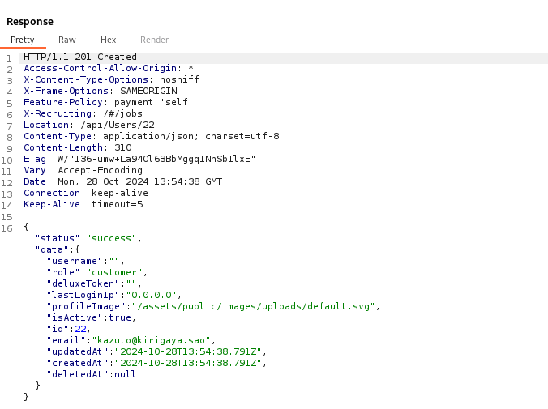
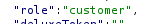
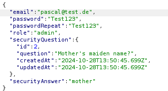
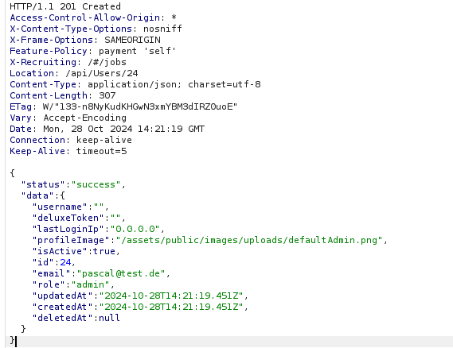
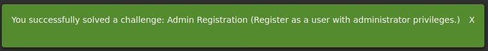

# Bericht: Challenge "Admin-Registrierung"

:::danger[Nur für Testzwecke]
Dieses Werkzeug ist ausschließlich für Ausbildung und autorisierte Penetrationstests gedacht. Es gegen Systeme einzusetzen, für die du keine ausdrückliche Testerlaubnis hast, ist strafbar und unethisch.
:::

**Projekt**: OWASP Juice Shop, Challenge "Admin Registration" (unzureichende Eingabeprüfung) <br/ >
**Werkzeuge**: Kali Linux mit Burp Suite <br/ >
**Autor**: Pascal Nehlsen <br/ >
**GitHub-Link**: [https://github.com/PascalNehlsen/juice-shop-challenges/blob/main/challenges/admin-registration.md](https://github.com/PascalNehlsen/juice-shop-challenges/blob/main/challenges/admin-registration.md)

## Inhalt

1. [Einführung](#einführung)
2. [Ziel](#ziel)
3. [Vorgehen](#vorgehen)
   - [Schritt 1: Informationen sammeln](#schritt-1-informationen-sammeln)
   - [Schritt 2: Registrierungs-Request verändern](#schritt-2-registrierungs-request-verändern)
4. [Fazit](#fazit)

### Einführung

Der OWASP Juice Shop ist eine absichtlich verwundbare Webanwendung, die verschiedene Sicherheitslücken vorführt. Dieser Bericht beschreibt die Schritte, mit denen ich die Challenge "Admin Registration" gelöst habe.

### Ziel

Bei dieser Challenge geht es darum, einen Nutzer als Administrator zu registrieren. Normalerweise lässt sich über die reguläre Registrierung kein Admin-Recht erlangen. Ziel war also, den Registrierungsmechanismus zu manipulieren oder eine Schwachstelle auszunutzen, um sich als Administrator anzumelden.

### Vorgehen

#### Schritt 1: Informationen sammeln

Um zu sehen, welche Daten bei der Registrierung an den Server gehen, habe ich die HTTP-Requests mit dem Proxy von Burp Suite abgefangen ("Intercept is on"). In den mitgeschnittenen Requests fand ich den Endpunkt `/api/Users/`, an den die Registrierungsdaten gehen und der sie in der Antwort zurückgibt. Schick diesen Request an den Repeater in Burp Suite, um die Antwort auf den `POST` zu sehen.

In der JSON-Antwort fiel mir der Schlüssel `"role"` mit dem Wert `"customer"` auf, also die Standardrolle eines Nutzers.

#### Schritt 2: Registrierungs-Request verändern

Ich habe diesen `POST`-Request an den Repeater von Burp Suite geschickt, wo ich ihn ändern und erneut senden kann. Dann habe ich den Schlüssel `"role"` mit dem Wert `"admin"` ergänzt, um eine Admin-Registrierung zu versuchen.

Auf diesen Request kam HTTP-Status `201` und eine Erfolgsmeldung zurück, der Nutzer war also als Admin registriert.

### Fazit

Der Test hat die Challenge gelöst, indem der `POST`-Request um den Parameter `"role": "admin"` ergänzt wurde, sodass ein normaler Nutzer mit Administratorrechten angelegt werden konnte.

---

**Repository:** [https://github.com/PascalNehlsen/juice-shop-challenges/blob/main/challenges/admin-registration.md](https://github.com/PascalNehlsen/juice-shop-challenges/blob/main/challenges/admin-registration.md)
