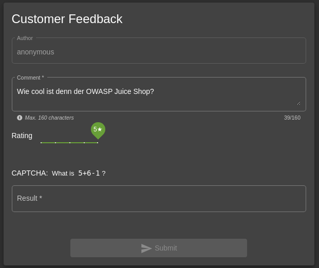
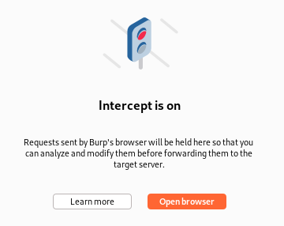
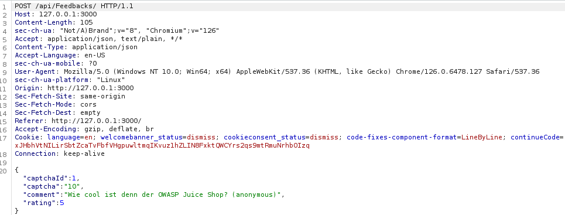
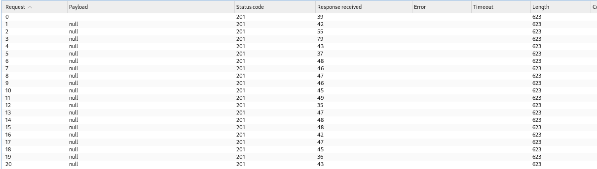
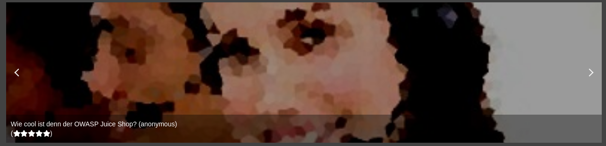

# Bericht: Challenge "CAPTCHA-Bypass"

:::danger[Nur für Testzwecke]
Dieses Werkzeug ist ausschließlich für Ausbildung und autorisierte Penetrationstests gedacht. Es gegen Systeme einzusetzen, für die du keine ausdrückliche Testerlaubnis hast, ist strafbar und unethisch.
:::

**Projekt**: OWASP Juice Shop, Challenge "CAPTCHA Bypass" (fehlerhafter Automatisierungsschutz) <br/ >
**Werkzeuge**: Kali Linux mit Burp Suite <br/ >
**Autor**: Pascal Nehlsen <br/ >
**GitHub-Link**: [https://github.com/PascalNehlsen/juice-shop-challenges/blob/main/challenges/captcha-bypass.md](https://github.com/PascalNehlsen/juice-shop-challenges/blob/main/challenges/captcha-bypass.md)

## Inhalt

1. [Einführung](#einführung)
2. [Ziel](#ziel)
3. [Vorgehen](#vorgehen)
   - [Schritt 1: Kundenfeedback schreiben](#schritt-1-kundenfeedback-schreiben)
   - [Schritt 2: CAPTCHA mit Burp Suite Intruder umgehen](#schritt-2-captcha-mit-burp-suite-intruder-umgehen)
4. [Fazit](#fazit)

### Einführung

Der OWASP Juice Shop ist eine absichtlich verwundbare Webanwendung, die Sicherheitslücken vorführt. Dieser Bericht beschreibt die Schritte, mit denen ich die Challenge "CAPTCHA Bypass" gelöst habe.

### Ziel

Ziel der Challenge ist es, das CAPTCHA im Feedback-Bereich zu umgehen, sodass mit einem einzigen gelösten CAPTCHA mehr als 10 Feedbacks innerhalb von 20 Sekunden abgeschickt werden.

### Vorgehen

#### Schritt 1: Kundenfeedback schreiben

Zuerst bin ich in den Feedback-Bereich gegangen und habe wie üblich ein Feedback für den OWASP Juice Shop ausgefüllt.

Hier kam die CAPTCHA-Abfrage. In diesem Fall war die Rechenaufgabe `5 + 6 - 1` zu lösen, also `10`.

Vor dem Absenden habe ich die Intercept-Funktion im Proxy von Burp Suite aktiviert.

Nach dem Absenden habe ich in der HTTP-History die ein- und ausgehenden Requests geprüft. Ich fand einen `POST` an `/api/Feedbacks/`. Im JSON des Requests sah ich folgende Schlüssel:

- `"captchaIds"`: enthält die Kennung des CAPTCHA
- `"captcha"`: enthält das errechnete Ergebnis (`10`)
- `"comment"`: enthält die eigentliche Feedback-Nachricht
- `"rating"`: die Bewertung für den Shop

#### Schritt 2: CAPTCHA mit Burp Suite Intruder umgehen

Diesen `POST`-Request schickte ich an den Intruder von Burp Suite, mit dem sich viele Requests in schneller Folge senden lassen.

Der Intruder war so eingestellt:

- **Attack Type**: Sniper
- **Payload Options**: keine
- **Payloads**: Null Payloads
- **Generate**: 20 Payloads

Mit diesen Einstellungen erzeugte der Intruder in kurzer Zeit 20 HTTP-Requests. In den Ergebnissen kam bei jedem Status `201` zurück, alle wurden also verarbeitet.

Zur Bestätigung bin ich zurück in den Feedback-Bereich und sah alle 20 Einträge nacheinander gelistet.

### Fazit

Der Test hat die Challenge gelöst, indem das CAPTCHA einmal gelöst und mit Burp Suite umgangen wurde, sodass innerhalb der erlaubten Zeit mehrere Feedbacks abgeschickt werden konnten.

---

**Repository:** [https://github.com/PascalNehlsen/juice-shop-challenges/blob/main/challenges/captcha-bypass.md](https://github.com/PascalNehlsen/juice-shop-challenges/blob/main/challenges/captcha-bypass.md)
