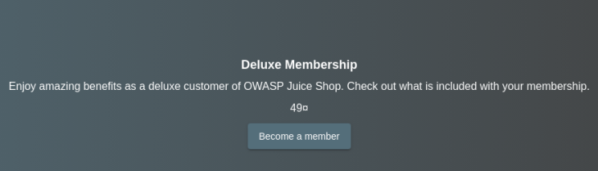
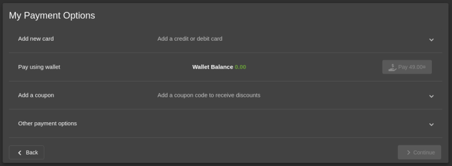
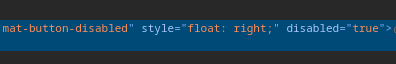
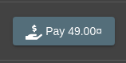
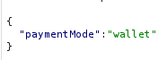
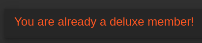
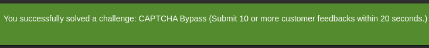

# Bericht: Challenge "Deluxe-Betrug"

:::danger[Nur für Testzwecke]
Dieses Werkzeug ist ausschließlich für Ausbildung und autorisierte Penetrationstests gedacht. Es gegen Systeme einzusetzen, für die du keine ausdrückliche Testerlaubnis hast, ist strafbar und unethisch.
:::

**Projekt**: OWASP Juice Shop, Challenge "Deluxe Fraud" (unzureichende Eingabeprüfung) <br/ >
**Werkzeuge**: Kali Linux mit Burp Suite, Firefox-Entwicklerwerkzeuge <br/ >
**Autor**: Pascal Nehlsen <br/ >
**GitHub-Link**: [https://github.com/PascalNehlsen/juice-shop-challenges/blob/main/challenges/deluxe-fraud.md](https://github.com/PascalNehlsen/juice-shop-challenges/blob/main/challenges/deluxe-fraud.md)

## Inhalt

1. [Einführung](#einführung)
2. [Ziel](#ziel)
3. [Vorgehen](#vorgehen)
   - [Schritt 1: Informationen sammeln](#schritt-1-informationen-sammeln)
   - [Schritt 2: Kauf-Request manipulieren](#schritt-2-kauf-request-manipulieren)
4. [Fazit](#fazit)

### Einführung

Der OWASP Juice Shop ist eine absichtlich verwundbare Webanwendung, die Sicherheitslücken vorführt. Dieser Bericht beschreibt die Schritte, mit denen ich die Challenge "Deluxe Fraud" gelöst habe.

### Ziel

Ziel ist, die "Deluxe-Mitgliedschaft" des OWASP Juice Shop kostenlos zu bekommen oder den Bezahlvorgang zu umgehen. Das bildet reale Angriffe nach, bei denen Zahlungen manipuliert oder Rabatte erzwungen werden, um ohne korrekte Zahlung an ein Produkt zu kommen.

### Vorgehen

#### Schritt 1: Informationen sammeln

Zuerst bin ich in den Bereich gegangen, in dem man die Deluxe-Mitgliedschaft kaufen kann.

Beim Klick auf "Become a Member" sah ich, dass die Mitgliedschaft 49,00 $ kostet, während unser Guthaben bei 0,00 $ stand. Der Kaufknopf war zudem deaktiviert.

Um zu sehen, wie der Knopf deaktiviert wurde, habe ich die Firefox-Entwicklerwerkzeuge geöffnet.

Im HTML fand ich die Attribute `mat-button-disabled` und `disabled='true'`. Nach dem Entfernen dieser Attribute über die Konsole ließ sich der Knopf aktivieren.

#### Schritt 2: Kauf-Request manipulieren

Ein Klick auf den Knopf löste allerdings nichts aus. Also fing ich den beim Klick gesendeten Request mit Burp Suite ab. Es war ein `POST` mit einem JSON-Objekt.

Der `paymentMode` zeigte, dass wir mit unserem Guthaben zahlen wollten, doch da wir keins hatten, änderte ich `paymentMode` in einen leeren String. Nach "Forward" kam eine Erfolgsmeldung, dass wir nun Deluxe-Mitglied seien, was sich auch auf der Seite bestätigte.

### Fazit

Die Challenge wurde gelöst, indem der `POST`-Request geändert wurde, sodass ich ohne korrekte Zahlung eine Deluxe-Mitgliedschaft erhielt.

---

**Repository:** [https://github.com/PascalNehlsen/juice-shop-challenges/blob/main/challenges/deluxe-fraud.md](https://github.com/PascalNehlsen/juice-shop-challenges/blob/main/challenges/deluxe-fraud.md)
