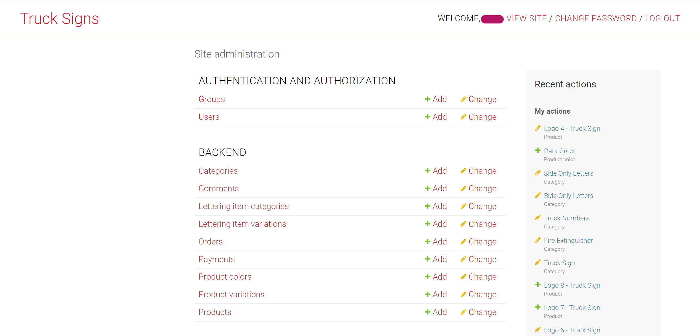

<div align="center">


# Schilder für Trucks

<span class="pill">Python 3.8.10</span> <span class="pill">Django 2.2.8</span> <span class="pill">DRF 3.12.4</span>

</div>

## Inhalt

- [Beschreibung](#beschreibung)
- [Installation](#installation)
- [Benutzung](#benutzung)
- [Screenshots des Django-Admin-Panels](#screenshots-des-django-admin-panels)
- [Nützliche Links](#nützliche-links)

## Beschreibung

**Signs for Trucks** ist ein Onlineshop für vorgestaltete Folien mit eigenen Schriftzeilen, im Englischen oft "truck lettering". Kundinnen und Kunden können außerdem eigene Entwürfe hochladen und direkt auf der Seite anpassen. Neben den Folien, dem Hauptprodukt des Shops, gibt es einfache Schriftfolien ohne Truck-Logo, eine Feuerlöscher-Folie und Folien, die nur die Fahrzeugnummer tragen (oder eine andere Nummer nach Wunsch).

### Einstellungen

Der Ordner **settings** innerhalb von trucks_signs_designs enthält die Konfiguration je Umgebung (bisher Entwicklung, Docker-Test und Produktion). Diese Dateien erweitern `base.py`, in der die gemeinsame Grundkonfiguration steht (etwa der Pfad zum Template-Verzeichnis). Zusätzlich liegt in diesem Ordner die `.env` mit den Umgebungsvariablen, die meist sensible Werte enthalten und vor dem Einsatz immer gesetzt werden müssen. Standardmäßig ist die Docker-Test-Umgebung aktiv. Umgestellt wird sie in der Datei `__init.py__`.

### Modelle

Die meisten Modelle tun das, was ihr Name vermuten lässt. Die folgenden Punkte klären den Zweck einiger davon:

- **Category:** die Kategorie der Folien im Shop. Enthält den Titel der Kategorie und die Grundeigenschaften, die Produkte derselben Kategorie teilen. _Truck Logo_ ist zum Beispiel die Kategorie für alle Folien mit Truck-Logo plus Schriftzeilen (die Folien selbst sind Instanzen des Modells _Product_). Eine weitere Kategorie ist _Fire Extinguisher_ für alle Folien mit Feuerlöscher-Logo.
- **Lettering Item Category:** die Kategorie der Beschriftung, zum Beispiel _Company Name_ oder _VIM NUMBER_. Jede hat eine eigene Preisgestaltung.
- **Lettering Item Variations:** enthält einen Fremdschlüssel auf **Lettering Item Category** und den Text, den der Kunde eingegeben hat.
- **Product Variation:** hat das ursprüngliche Produkt als Fremdschlüssel plus die Schriftzeilen (Instanzen von **Lettering Item Variations**), die der Kunde ergänzt hat.
- **Order:** enthält den Warenkorb (hier eine einzelne Folie, da pro Vorgang nur ein Produkt gekauft werden kann) sowie Kontakt- und Versandangaben.
- **Payment:** enthält die Zahlungsdaten, etwa den Zeitpunkt des Kaufs und die Kunden-ID bei Stripe.

Für die Zahlungen wird [Stripe](https://stripe.com/) als Zahlungsanbieter genutzt.

### Kurz zu den Views

Die meisten Views sind klassenbasiert und kommen aus _rest_framework.generics_. Sie geben der Backend-API die üblichen CRUD-Operationen und erben entsprechend von _ListAPIView_, _CreateAPIView_, _RetrieveAPIView_ und so weiter.

Einige Views mussten angepasst werden, etwa für das Anlegen von Bestellung und Zahlung: hier sind beide Funktionen in einem View umgesetzt, der deshalb von _GenericAPIView_ erbt. Ein weiteres Beispiel ist der View _UploadCustomerImage_, der die vom Kunden hochgeladene Vorlage nimmt und daraus ein neues Produkt erzeugt.

## Installation

1. Repository klonen:
   ```bash
   git clone <INSERT URL>
   ```
1. Virtuelle Umgebung anlegen und die Datenbank aufsetzen. Siehe [Anleitung für virtuelle Umgebungen](https://docs.python-guide.org/dev/virtualenvs/) und [Anleitung für das Datenbank-Setup](https://www.digitalocean.com/community/tutorials/how-to-set-up-django-with-postgres-nginx-and-gunicorn-on-ubuntu-16-04).
1. Umgebungsvariablen setzen.

   1. Kopiere den Inhalt der Beispiel-env-Datei aus dem Ordner truck_signs_designs in eine `.env`:
      ```bash
      cd truck_signs_designs/settings
      cp simple_env_config.env .env
      ```
   1. Die neue `.env` sollte alle Variablen enthalten, die die Django-App in allen Umgebungen braucht. Für die Entwicklungsumgebung genügen aber diese:

      ```bash
      SECRET_KEY=<secret_key>
      DB_NAME=<db_name>
      DB_USER=<db_user>
      DB_PASSWORD=<dev_db_password>
      DB_HOST=<localhost>
      DB_PORT=<5432>
      STRIPE_PUBLISHABLE_KEY=<stripe_pub_key>
      STRIPE_SECRET_KEY=<stripe_secret_key>
      EMAIL_HOST_USER=<your.email@gmail.com>
      EMAIL_HOST_PASSWORD=<your_password>

      # creating a superuser
      DJANGO_SUPERUSER_USERNAME=admin
      DJANGO_SUPERUSER_EMAIL=admin@example.com
      DJANGO_SUPERUSER_PASSWORD=adminpassword
      ```

   1. Für die Datenbank sind das die Standardwerte:
      ```bash
      DB_NAME=trucksigns_db
      DB_USER=trucksigns_user
      DB_PASSWORD=supertrucksignsuser!
      DB_HOST=localhost
      DB_PORT=5432
      ```
   1. SECRET_KEY ist der Django-Secret-Key. Wie du einen neuen erzeugst, steht hier: [Stackoverflow](https://stackoverflow.com/questions/41298963/is-there-a-function-for-generating-settings-secret-key-in-django)

   1. **HINWEIS: für die Übung nicht nötig**<br/>STRIPE_PUBLISHABLE_KEY und STRIPE_SECRET_KEY bekommst du über ein Entwicklerkonto bei [Stripe](https://stripe.com/).

      - So kommst du an die Keys:
        1. Melde dich in deinem Stripe-Entwicklerkonto an (stripe.com) oder erstelle ein neues (stripe.com > Sign Up). Danach landest du im Dashboard.
        1. Geh auf Developer > API Keys und kopiere Publishable Key und Secret Key.

   1. EMAIL_HOST_USER und EMAIL_HOST_PASSWORD sind die Zugangsdaten, mit denen die Seite bei einem Kauf E-Mails verschickt. Das ist derzeit abgeschaltet; der Code dafür steht als Kommentar in `views.py` im View zum Anlegen der Bestellung. Es funktioniert also jede gültige Kombination aus Adresse und Passwort.

1. Migrationen und dann die App ausführen:
   ```bash
   python manage.py migrate
   python manage.py runserver
   ```
1. Fertig =) !!! Die App sollte unter [localhost:8000](http://localhost:8000) laufen.
1. (Optional) Einen Superuser anlegen:
   ```bash
   python manage.py createsuperuser
   ```

## Benutzung

1. Ein [Dockerfile](https://github.com/PascalNehlsen/truck_signs_api/blob/main/Dockerfile) auf oberster Ebene anlegen

2. Docker-Image bauen

   ```bash
   docker build -t <image-name>:<tag-name> .
   ```

   - `-t`: steht für "tag". Benennt das Image im Format `<image-name>:<tag-name>`.
   - `.`: das aktuelle Verzeichnis, in dem Dockerfile und Build-Kontext liegen.

3. Netzwerk anlegen

   ```bash
   docker network create <network-name>
   ```

   - `<network-name>`: der Name des neuen Netzwerks. Er muss in der Docker-Umgebung eindeutig sein.
   - Datenbank und Container können in diesem Netzwerk miteinander sprechen.

4. Postgres-Container starten

   ```bash
   docker run --name <docker-name> \
      --network <networkname> \
      -e POSTGRES_PASSWORD=<postgres-password> \
      -e POSTGRES_USER=<postgres-user> \
      -e POSTGRES_DB=<postgres-db-name> \
      -v <postgres-volume>:/var/lib/postgresql/data \ #store the postgres data in a volume
      -d postgres
   ```

   - `<network-name>`: das Netzwerk, das du vorher angelegt hast.
   - Postgres-Daten: die Zugangsdaten, die du vorher festgelegt hast.

5. Anwendungs-Container starten

   ```bash
   docker run --name <container-name> \
      --network <network-name> \
      -p 8020:8000 \
      -v <media-volume>:/app/media \
      -v <static-volume>:/app/static \
      --restart on-failure \
      <image-name>:<image-tag>
   ```

   - `<network-name>`: dasselbe Netzwerk wie beim Postgres-Container.
   - Dieser Container hört auf Port 8020.
   - `--restart on-failure`: startet den Container nach einem Fehler automatisch neu.
   - `<image-name>:<image-tag>`: der Name deines Images aus dem Build.

**HINWEIS:** Um Truck-Folien mit Truck-Logo anzulegen, erstelle zuerst die **Kategorie** Truck Sign und dann das **Produkt** (Name beliebig). Nur so holt das Frontend die Truck-Folien für das Produktraster, denn es fragt ausschließlich Produkte der Kategorie Truck Sign ab.

---

<a name="screenshots"></a>

## Screenshots des Django-Admin-Panels

### Mobile Ansicht

<div align="center">

  

---

 </div>

### Desktop-Ansicht



---


---


<a name="useful_links"></a>

## Nützliche Links

### PostgreSQL-Datenbank

- Datenbank aufsetzen: [Digital Ocean, Django-Deployment auf einem VPS](https://www.digitalocean.com/community/tutorials/how-to-set-up-django-with-postgres-nginx-and-gunicorn-on-ubuntu-16-04)

### Docker

- [Offizielle Docker-Dokumentation](https://docs.docker.com/)
- Django, PostgreSQL, gunicorn und nginx dockerisieren:
  - GitHub-Repo von sunilale0: [Link](https://github.com/sunilale0/django-postgresql-gunicorn-nginx-dockerized/blob/master/README.md#nginx)
  - Artikel von Michael Herman auf testdriven.io: [Link](https://testdriven.io/blog/dockerizing-django-with-postgres-gunicorn-and-nginx/)

### Django und DRF

- [Offizielle Django-Dokumentation](https://docs.djangoproject.com/en/4.0/)
- Neuen Secret-Key erzeugen: [Stackoverflow](https://stackoverflow.com/questions/41298963/is-there-a-function-for-generating-settings-secret-key-in-django)
- Django-Admin anpassen:
  - Kleine Anpassungen (Suche, Spalten, ...): [Link](https://realpython.com/customize-django-admin-python/)
  - Templates und CSS anpassen: [Artikel auf Medium](https://medium.com/@brianmayrose/django-step-9-180d04a4152c)
- [Offizielle Dokumentation des Django REST Framework](https://www.django-rest-framework.org/)
- Mehr zu verschachtelten Serializern: [Stackoverflow](https://stackoverflow.com/questions/51182823/django-rest-framework-nested-serializers)
- Mehr zu Generic Views: [testdriven.io](https://testdriven.io/blog/drf-views-part-2/)

### Verschiedenes

- Virtuelle Umgebung mit virtualenv und virtualenvwrapper: [Link](https://docs.python-guide.org/dev/virtualenvs/)
- [CORS konfigurieren](https://www.stackhawk.com/blog/django-cors-guide/)
- [Django mit Cloudinary einrichten](https://cloudinary.com/documentation/django_integration)

---

**Repository:** [https://github.com/PascalNehlsen/truck_signs_api](https://github.com/PascalNehlsen/truck_signs_api)
