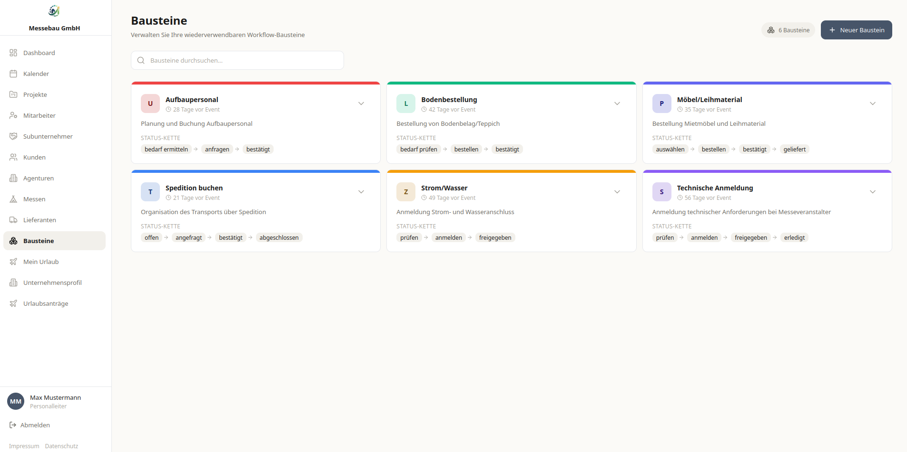
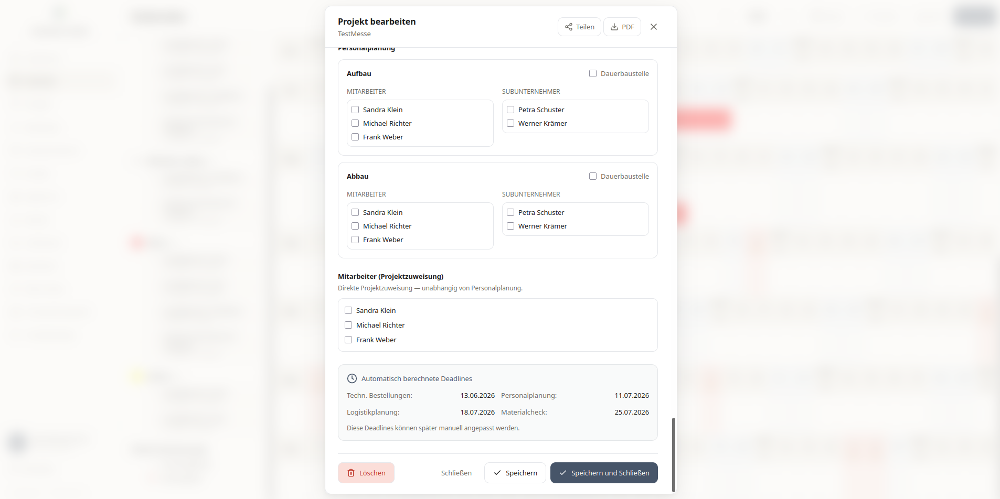
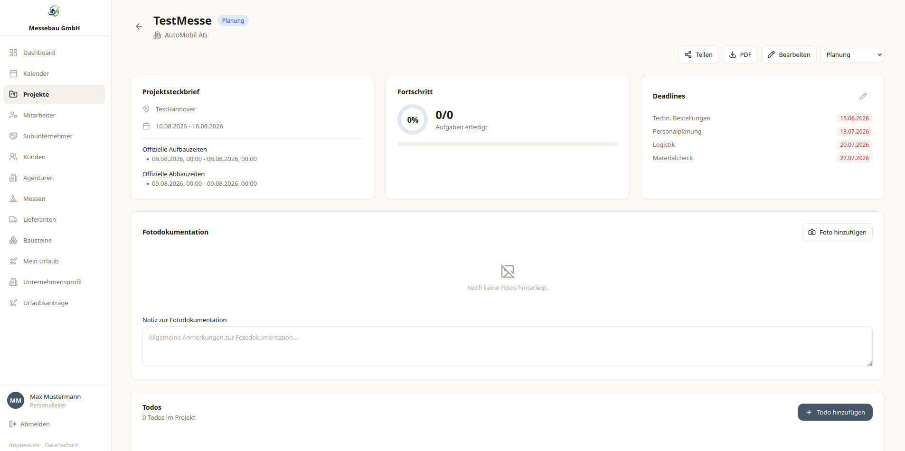
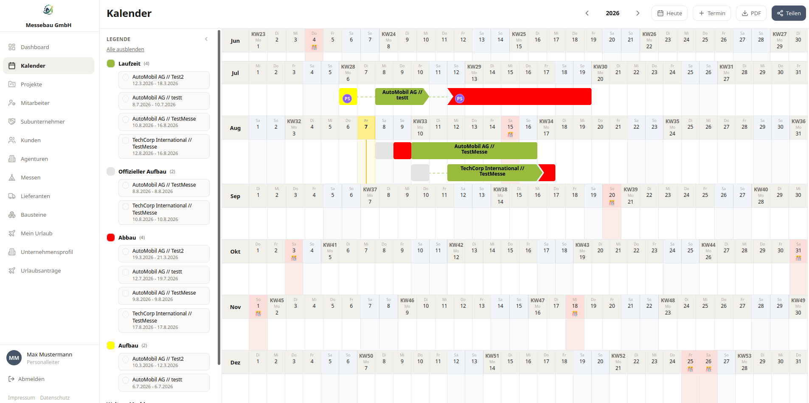

# Runnz

:::info[Live · Login erforderlich]
[runnz.de](https://runnz.de). Das Repository ist privat; dieser Aufschrieb ist
das Artefakt.
:::

## Das Problem

Messebau läuft rückwärts von einem Datum, das sich nicht verschieben lässt. Die
Halle öffnet am Dienstag, also muss der Stand am Montag stehen, also geht die
Fracht am Donnerstag raus, also sind die Druckdaten am Freitag davor fix, also
muss die Kundenfreigabe zwei Wochen früher da sein. Reißt ein Glied, rutscht
die ganze Kette auf eine Messe, die nicht wartet.

Die meisten Betriebe planen das in einer Tabelle pro Projekt und bauen dieselbe
Abhängigkeitskette jedes Mal neu. Zwischen Projekten ist die Kette fast
identisch. Was sich unterscheidet, ist der Aufbautermin.

## Das Modell

Zwei Ideen tragen das Produkt.

**Workflow-Blöcke.** Eine wiederverwendbare Arbeitseinheit, die statt eines
absoluten Datums einen Versatz zum Termin trägt, plus ihre eigene Statuskette.
Die technische Anmeldung liegt 56 Tage vor dem Termin und läuft durch
`prüfen → anmelden → freigegeben → erledigt`. Die Fracht zu buchen liegt bei
21 Tagen und läuft `offen → angefragt → bestätigt → abgeschlossen`. Der Versatz
kodiert die Planungsregel, die Kette kodiert, was "fertig" für diese Art Arbeit
bedeutet, und das ist bei einer Bodenbestellung etwas anderes als bei einem
Stromanschluss.

Blöcke werden auf ein Projekt angewendet, und die konkreten Fristen fallen
automatisch aus dem Termin heraus. Verschiebe den Termin, und die ganze Kette
wandert mit.

Abgeleitet, nicht festgenagelt. Der Hinweis unter den berechneten Daten sagt,
dass sie später überschrieben werden können, und das ist wichtig: das Modell ist
ein Standard, der meistens stimmt, keine Fessel, die gegen die Planerin
arbeitet, wenn eine Halle ihre Zufahrtszeiten ändert.

**Ein Jahr auf einen Blick.** Messebauunternehmen fahren viele Projekte mit
überlappenden Crews und überlappenden Hallen, also ist der Kalender die
Hauptoberfläche und keine Liste. Jedes Projekt wird als Laufzeit plus getrennte
Balken für Auf- und Abbau gezeichnet, und die offiziellen Fenster des
Veranstalters stehen getrennt von denen, die der Betrieb selbst plant. Eine
Planerin sieht in einer Zeile, wo zwei Messen in derselben Woche dieselbe Crew
wollen.

Vierzehn Backend-Module decken die umliegende Domäne ab: Kunden, Mitarbeitende
und deren Urlaube, Subunternehmen, Lieferanten, Dateianhänge und die
Aufgabeninstanzen selbst. Zweiunddreißig Migrationen, das Schema hat also echte
Veränderung hinter sich und wurde nicht einmal generiert.

Die Screenshots stammen aus der Staging-Umgebung mit Testdaten.

## Stack

| Schicht | Wahl |
| --- | --- |
| Backend | NestJS, TypeScript, TypeORM, PostgreSQL |
| Auth | JWT, bcrypt, rollenbasierte Zugriffskontrolle |
| Frontend | React 18, Vite, TypeScript, Tailwind, Zustand |
| Kalender / Boards | FullCalendar, Hello Pangea DnD |
| Ausrollen | Docker, GHCR, nginx, getrennte Pipelines für Staging und Produktion |

## Security im Delivery-Pfad

Das ist der Teil, der sich zu lesen lohnt, weil ihn die meisten Nebenprojekte
auslassen.

**Bevor der Commit existiert.** pre-commit führt `detect-secrets` gegen eine
committete Baseline aus, dazu `detect-private-key`, eine Sperre für große
Dateien und `no-commit-to-branch`. Ein Credential muss erst an einem Hook auf
der Entwicklermaschine vorbei, bevor es ein Remote erreicht.

**Bei jedem Push.** Ein eigener `security.yml`-Workflow fährt drei Jobs:
`npm audit` über beide Workspaces ohne Dev-Abhängigkeiten, einen
`detect-secrets`-Scan im Diff gegen die Baseline, sodass nur *neue* Findings
fehlschlagen, und GitHubs Dependency Review bei Pull Requests nach `main`.

**Auf dem Weg nach draußen.** Images bauen nach GHCR und rollen über SSH aus.
Staging und Produktion sind getrennte Pipelines, damit der Staging-Weg eine
echte Probe ist und kein Flag.

Die `.env`-Datei liegt nicht im Repository, was nach einer niedrigen Hürde
klingt, bis man nachzählt, wie viele Multi-Tenant-Nebenprojekte sie reißen.

## Was ich ändern würde

Zwei Dinge, benannt, weil eine Projektseite, die nur Stärken auflistet, eine
Anzeige ist.

**Die Tenant-Isolation wird im Anwendungscode erzwungen.** Jede Service-Methode
nimmt eine `tenantId`, und jede Query filtert darauf. Es funktioniert und es
liest sich gut, aber die Garantie ist nur so stark wie die Disziplin: eine
einzige Query ohne den Filter ist ein Lesezugriff über Tenant-Grenzen hinweg,
und strukturell hält das nichts auf. Die stärkere Form ist Row-Level Security in
PostgreSQL, wo die Datenbank die Query verweigert, statt darauf zu vertrauen,
dass der Service richtig gefragt hat. Das ist die Migration, die ich als
nächstes machen würde, und es ist die ehrliche Antwort, wenn jemand fragt, wie
die Isolation durchgesetzt wird.

**Das Dependency-Audit ist lockerer als sein Etikett.** Der Workflow-Schritt
heißt "HIGH+", führt aber `npm audit --audit-level=critical` aus, sodass
Findings der Stufe high stillschweigend durchgehen. Eine Prüfung, deren Name und
Verhalten sich widersprechen, ist schlimmer als keine Prüfung, weil sie
Zuversicht erkauft, die sie nicht verdient hat. Es ist eine Ein-Wort-Korrektur,
und es ist die Sorte Fund, die nur auftaucht, wenn man die eigene Pipeline liest,
als hätte sie jemand anderes geschrieben.
